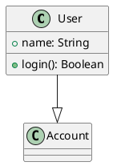
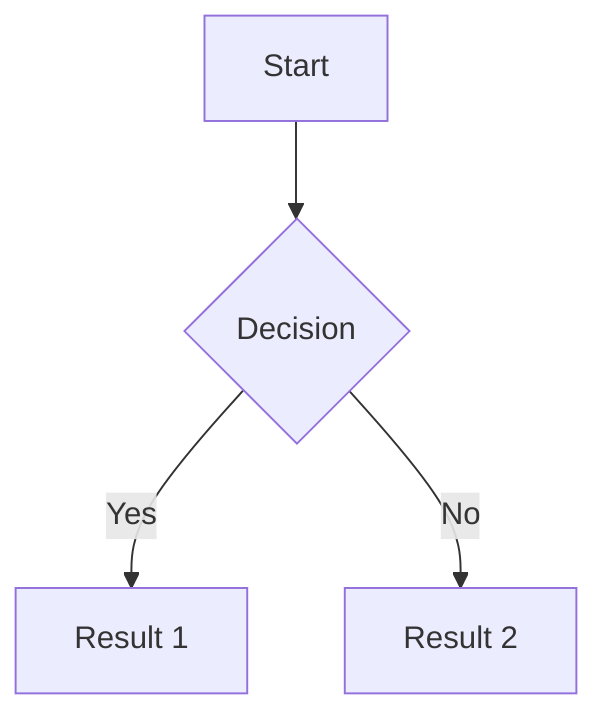

# Living Specification Systems Research

## Executive Summary

This research explores existing tools, formats, and methodologies for living specifications, requirements management, and structured project documentation. The goal is to inform the design of a new "living spec" system that combines the best practices from enterprise requirements management, documentation-as-code, and AI-agent-friendly specification systems.

---

## 1. Requirements Management Tools

### IBM DOORS / DOORS Next

**Format**: Proprietary database with ReqIF (XML) import/export

**Key Features**:
- Dynamic Object Oriented Requirements System
- Client-server architecture with Windows client, Linux/Windows/Solaris servers
- Web client (DOORS Web Access) and DOORS Next (cloud-native)
- Custom scripting via DOORS eXtension Language (DXL)

**Hierarchy & Relationships**:
- Requirements can be linked to design items, test plans, test cases, and other requirements
- Full V-Model traceability across levels
- OSLC (Open Services for Lifecycle Collaboration) for integration

**Strengths**:
- Industry standard, especially in automotive/aerospace
- Concurrent editing with automatic versioning
- Strong traceability and change impact analysis
- ReqIF standard support for tool interoperability

**Weaknesses**:
- Proprietary, expensive licensing
- Heavy enterprise tooling, steep learning curve
- Limited plain-text/developer-friendly workflows

**Lessons**: Strong traceability model and link types; ReqIF as interchange format worth studying.

Sources:
- [IBM Engineering Requirements DOORS](https://www.ibm.com/products/requirements-management)
- [DOORS Wikipedia](https://en.wikipedia.org/wiki/DOORS)

---

### Jama Connect

**Format**: Proprietary database with ReqIF import/export

**Key Features**:
- "Live Traceability" through the development lifecycle
- Automatic and intelligent field mapping during import
- Support for one-time migration or ongoing sync between instances

**Hierarchy & Relationships**:
- Hierarchical project structure (project root, components, sets, folders)
- All items, relationships, and attachments serialized in exports
- Upstream and downstream traceability between requirements

**Strengths**:
- Strong ReqIF support for customer/supplier exchanges
- Designed for regulated industries (aerospace, automotive, medical)
- Integration with MATLAB/Simulink for model-based development
- Flexibility in import/export workflows

**Weaknesses**:
- Proprietary SaaS platform
- Vendor lock-in concerns
- Not developer/git-friendly

**Lessons**: The concept of "Live Traceability" and maintaining traceability during data transfers is valuable.

Sources:
- [Jama Connect Interchange for ReqIF](https://www.jamasoftware.com/datasheet/jama-connect-interchange-for-reqif/)
- [Jama Connect Features](https://www.jamasoftware.com/platform/jama-connect/features/)

---

### Siemens Polarion ALM

**Format**: Proprietary with built-in ReqIF support

**Key Features**:
- "LiveDocs" - concurrent, secure collaboration on specification documents
- Every paragraph uniquely identifiable and traceable
- Import wizard for Microsoft Word/Excel assets
- Manages millions of requirements across multiple servers

**Hierarchy & Relationships**:
- Work Items hierarchy in documents
- Cross-references exported as HTML hyperlinks in ReqIF
- Full audit trails and change control

**Strengths**:
- Browser-based modern platform
- Strong compliance support (Automotive SPICE, ISO 26262)
- ReqIF round-trip improved by up to 80% in recent versions
- Test steps can be included in ReqIF definitions

**Weaknesses**:
- Enterprise pricing
- Complex setup for smaller teams
- Not optimized for code-adjacent workflows

**Lessons**: LiveDocs concept of making every paragraph identifiable/traceable is powerful.

Sources:
- [Polarion Requirements](https://polarion.plm.automation.siemens.com/products/polarion-requirements)
- [Polarion ALM 2404 Release Notes](https://blogs.sw.siemens.com/polarion/polarion-alm-2404-whats-new-and-noteworthy/)

---

### Perforce Helix RM (Helix ALM)

**Format**: Proprietary database with document export

**Key Features**:
- Requirement documents in outline format
- Customizable templates and traceability matrices
- Deep integration with version control (Perforce)
- Tags for grouping related filters/reports

**Hierarchy & Relationships**:
- Parent/child relationships between requirements
- Links to test cases and other ALM items
- Impact analysis before making changes

**Strengths**:
- Tight integration with Perforce version control
- Highly customizable workflows
- Good for teams already using Perforce

**Weaknesses**:
- Less widely adopted than DOORS/Jama
- Perforce ecosystem dependency

**Lessons**: Integration with version control is a key differentiator.

Sources:
- [Perforce Helix Requirements Management](https://www.perforce.com/products/helix-requirements-management)
- [Helix ALM What's New](https://www.perforce.com/products/helix-alm/whats-new-helix-alm)

---

## 2. Documentation-as-Code / Living Documentation

### OpenAPI (Swagger)

**Format**: YAML or JSON

**Structure**:
```yaml
openapi: 3.x.x
info:
  title: API Name
  version: 1.0.0
paths:
  /endpoint:
    get:
      responses:
        '200':
          description: Success
components:
  schemas:
    Model:
      type: object
```

**Hierarchy & Relationships**:
- Root object with `openapi`, `info`, `paths`, `components`, `webhooks`
- `$ref` references for reusability
- Model composition via `allOf`, polymorphism via `discriminator`
- Multi-document support with references between files

**Strengths**:
- Industry standard for REST APIs
- Massive tooling ecosystem (code generation, documentation, testing)
- Human-readable YAML format
- Round-trip compatible between YAML and JSON

**Weaknesses**:
- API-specific, not general-purpose specification
- Can become verbose for complex APIs
- Limited expressiveness for non-REST patterns

**Lessons**:
- Model-based approach with reusable components is powerful
- Reference system (`$ref`) enables modular specs
- Multiple output formats from single source

Sources:
- [OpenAPI Specification Structure](https://learn.openapis.org/specification/structure.html)
- [OpenAPI Spec v3.2.0](https://spec.openapis.org/oas/v3.2.0.html)

---

### AsyncAPI

**Format**: YAML or JSON (YAML 1.2 recommended)

**Structure**: Similar to OpenAPI but for event-driven/message-based APIs
- `asyncapi` version
- `info` metadata
- `channels` (instead of paths)
- `components` for reusable definitions

**Hierarchy & Relationships**:
- Channels define publish/subscribe patterns
- Message schemas with payload definitions
- Server bindings for different protocols (Kafka, AMQP, WebSocket)

**Strengths**:
- Built on OpenAPI foundation, familiar syntax
- Comprehensive tooling (Studio, Generator, React renderer)
- Supports code scaffolding generation
- Growing adoption for event-driven architectures

**Weaknesses**:
- Less mature than OpenAPI
- Protocol-specific complexity

**Lessons**: Extension of established patterns (OpenAPI) for new domains works well.

Sources:
- [AsyncAPI Specification v3.0.0](https://www.asyncapi.com/docs/reference/specification/v3.0.0)
- [AsyncAPI Document Structure](https://www.asyncapi.com/docs/concepts/asyncapi-document/structure)

---

### Cucumber / Gherkin (BDD)

**Format**: Plain text `.feature` files

**Structure**:
```gherkin
Feature: User Login
  As a user
  I want to log in
  So that I can access my account

  Scenario: Successful login
    Given I am on the login page
    When I enter valid credentials
    Then I should see the dashboard
```

**Keywords**: Feature, Scenario, Given, When, Then, And, But, Background, Scenario Outline

**Hierarchy & Relationships**:
- Features contain Scenarios
- Scenarios contain Steps
- Step definitions connect to implementation code
- Tags for categorization and filtering

**Strengths**:
- Human-readable, business stakeholder accessible
- Executable specifications (tests generated from specs)
- True "living documentation" - always in sync with implementation
- Declarative style focuses on behavior, not implementation

**Weaknesses**:
- Requires discipline to maintain quality
- Step definitions can become maintenance burden
- Not suitable for all types of specifications

**Lessons**:
- Executable specifications ensure docs stay current
- Natural language with structured keywords is powerful
- Declarative style (what, not how) improves maintainability

Sources:
- [Cucumber Gherkin Reference](https://cucumber.io/docs/gherkin/reference/)
- [Writing Better Gherkin](https://cucumber.io/docs/bdd/better-gherkin/)

---

### Arc42

**Format**: Available in Markdown, AsciiDoc, Word, Confluence, LaTeX, HTML

**Structure**: 12 standardized sections:
1. Introduction and goals
2. Constraints
3. Context and scope
4. Solution strategy
5. Building block view
6. Runtime view
7. Deployment view
8. Crosscutting concepts
9. Architecture decisions
10. Quality
11. Risks and technical debt
12. Glossary

**Hierarchy & Relationships**:
- Hierarchical decomposition in Building Block View
- References between sections
- All sections optional, adapt to needs

**Strengths**:
- Pragmatic, practical approach
- Format-agnostic
- Extensive documentation with 140+ tips
- Can be combined with C4 model
- Free and open source

**Weaknesses**:
- Manual maintenance required
- No built-in tooling for validation
- Less formalized than enterprise tools

**Lessons**:
- Standardized sections provide consistency
- Format flexibility is valuable
- Optional sections allow adaptation

Sources:
- [Arc42 Template Overview](https://arc42.org/overview)
- [Arc42 GitHub Repository](https://github.com/arc42/arc42-template)

---

### C4 Model / Structurizr DSL

**Format**: Custom DSL (text-based)

**Structure**:
```
workspace {
    model {
        user = person "User"
        softwareSystem = softwareSystem "Software System" {
            webapp = container "Web Application"
            database = container "Database"
        }
        user -> webapp "Uses"
        webapp -> database "Reads from and writes to"
    }
    views {
        systemContext softwareSystem {
            include *
            autoLayout
        }
    }
}
```

**Hierarchy**:
- 4 levels: Context, Container, Component, Code
- Model-based: define once, generate multiple diagrams
- Groups for organizing elements
- Archetypes for user-defined types

**Strengths**:
- Model-based, not just diagram-based
- Multiple views from single model
- Text-based, version control friendly
- Can include `!docs` and `!adrs` for documentation
- Export to PlantUML, Mermaid, and other formats

**Weaknesses**:
- Learning curve for DSL
- Less flexible than freeform diagramming
- Opinionated about abstraction levels

**Lessons**:
- Model-first approach enables consistency
- Hierarchical abstraction levels are intuitive
- DSL can embed related documentation (ADRs, docs)

Sources:
- [Structurizr DSL Documentation](https://docs.structurizr.com/dsl)
- [C4 Model Home](https://c4model.com/)

---

### Architecture Decision Records (ADR / MADR)

**Format**: Markdown

**MADR Template Structure**:
```markdown
# [short title of solved problem and solution]

## Status
[proposed | rejected | accepted | deprecated | superseded by ADR-xxx]

## Context
[Describe the context and problem statement]

## Decision Drivers
* [driver 1]
* [driver 2]

## Considered Options
* [option 1]
* [option 2]

## Decision Outcome
Chosen option: "[option]", because [justification].

### Positive Consequences
* [e.g., improvement of quality attribute satisfaction]

### Negative Consequences
* [e.g., compromising quality attribute]
```

**Strengths**:
- Simple, lightweight format
- Captures rationale, not just decisions
- Version controlled with code
- Templates: minimal, bare, full versions
- MIT/CC0 licensed

**Weaknesses**:
- No built-in linking/traceability
- Manual maintenance
- Can become stale

**Lessons**:
- Capturing "why" is as important as "what"
- Options and trade-offs should be documented
- Status tracking enables lifecycle management

Sources:
- [MADR About](https://adr.github.io/madr/)
- [ADR Templates](https://adr.github.io/adr-templates/)
- [Joel Parker Henderson ADR Examples](https://github.com/joelparkerhenderson/architecture-decision-record)

---

## 3. Spec-First Development Tools

### GitHub Spec Kit

**Format**: Markdown files with structured sections

**Workflow**: Constitution → Specify → Plan → Tasks → Implement → PR

**Key Files**:
- Specification documents
- Technical implementation plans
- Actionable task lists

**Features**:
- AI-agent agnostic (supports Copilot, Claude, Gemini, Cursor, etc.)
- CLI for workspace setup: `specify init <project> --ai <agent>`
- Slash commands: `/specify`, `/plan`, `/tasks`

**Strengths**:
- Open source (MIT)
- Works with multiple AI assistants
- Structured workflow enforces discipline
- Shared context as reusable asset

**Weaknesses**:
- Relatively new (2025)
- Requires discipline to follow workflow
- AI may not always follow all instructions

**Lessons**:
- Phased workflow (specify → plan → tasks → implement) reduces errors
- AI-agnostic design increases adoption
- Specifications as source of truth enables tool switching

Sources:
- [GitHub Blog: Spec-driven development](https://github.blog/ai-and-ml/generative-ai/spec-driven-development-with-ai-get-started-with-a-new-open-source-toolkit/)
- [GitHub Spec Kit Repository](https://github.com/github/spec-kit)

---

### Amazon Kiro

**Format**: Markdown with EARS notation

**Three Core Files**:
1. `requirements.md` - User stories with acceptance criteria (EARS format)
2. `design.md` - Technical architecture, components, data models
3. `tasks.md` - Checklist of implementation tasks

**EARS Format**:
```
WHEN [condition/event] THE SYSTEM SHALL [expected behavior]
```

**Features**:
- Specs stay synced with evolving codebase
- "Hooks" - user prompts triggered by file changes
- MCP server integration for automation
- Supports Claude Sonnet 4.5 and Auto mode

**Strengths**:
- Production-focused (vs. "vibe coding")
- Bi-directional sync (code ↔ specs)
- Enterprise-ready with AWS integration
- Clear audit trails

**Weaknesses**:
- IDE lock-in (Kiro is a full IDE)
- AWS ecosystem oriented

**Lessons**:
- EARS notation provides structured requirements format
- Bi-directional sync keeps specs current
- Hooks for automation based on file changes

Sources:
- [Kiro Specs Documentation](https://kiro.dev/docs/specs/)
- [Kiro and the Future of Software Development](https://kiro.dev/blog/kiro-and-the-future-of-software-development/)

---

### OpenAPI Code Generators

**Tools**:
- OpenAPI Generator (50+ languages)
- Swagger Codegen
- oapi-codegen (Go-specific)
- Hey API (TypeScript-specific)

**Generates**:
- Client SDKs
- Server stubs
- Documentation
- Configuration files

**Strengths**:
- Spec-first workflow
- Consistent API implementations
- Reduces manual coding

**Lessons**: Generating code from specs ensures consistency and reduces drift.

Sources:
- [OpenAPI Generator GitHub](https://github.com/OpenAPITools/openapi-generator)
- [OpenAPI Generator Tech](https://openapi-generator.tech/)

---

### Design by Contract (Eiffel)

**Concepts**:
- **Preconditions**: Must be true before routine execution (client responsibility)
- **Postconditions**: Guaranteed after execution (supplier responsibility)
- **Class Invariants**: Always-true properties of a class

**Formal Verification**:
- AutoProof translates contracts to logical formulas
- Verified by Why3, Boogie, Z3 backends
- Compile-time verification possible

**Language Support**:
- Native: Eiffel, Racket
- Libraries/tools: Ada 2005, Java (JSR-303), Python (contracts library)

**Lessons**:
- Contracts make expectations explicit and verifiable
- Runtime/compile-time checking catches issues early
- Clear responsibility assignment (client vs. supplier)

Sources:
- [Design by Contract - Eiffel](https://www.eiffel.com/values/design-by-contract/)
- [Design by Contract Wikipedia](https://en.wikipedia.org/wiki/Design_by_contract)

---

## 4. AI-Agent Friendly Spec Systems

### CLAUDE.md and Project Context Files

**File Types**:
- `CLAUDE.md` - Claude Code context
- `.cursor/rules/*.mdc` - Cursor rules
- `.copilot-instructions.md` - GitHub Copilot
- `.aiignore` / `.cursorignore` / `.codeiumignore` - Exclusion files

**Structure**:
```markdown
# Project Context

## Repository Guidelines
- Branch naming conventions
- Merge vs. rebase policy

## Development Environment
- Required tools and versions
- Setup instructions

## Architecture Overview
- Key components
- Important patterns
```

**Hierarchy**:
- Root-level provides global context
- Nested files in subdirectories provide specific context
- Files auto-loaded based on working directory

**Best Practices**:
- Update when AI consistently gets something wrong
- Use nested configs for monorepos
- Team members can commit shared context

**Lessons**:
- Context files should evolve with the project
- Hierarchical context (global → specific) is effective
- Multiple file formats can coexist

Sources:
- [Claude Code Best Practices](https://www.anthropic.com/engineering/claude-code-best-practices)
- [Mastering Project Context Files](https://eclipsesource.com/blogs/2025/11/20/mastering-project-context-files-for-ai-coding-agents/)

---

### Spec-Driven Development Patterns (2025)

**Common Workflow**:
1. Intent → Specification
2. Specification → Technical Plan
3. Plan → Atomic Tasks
4. Tasks → Implementation

**Key Principles**:
- Features translated to user stories first
- Atomic tasks with limited scope (1-2 files)
- "Constitution" files for global standards
- "Lessons learned" feedback loop

**Benefits**:
- Consistent quality across implementations
- Predictable, reviewable chunks
- AI has focused context per task
- Reduced "vibe coding" errors

**Adoption** (2025 Stack Overflow Survey):
- 47.1% use AI tools daily
- 84% use or plan to use AI in development
- Only 22% "very favorable" sentiment (trust issues)

**Lessons**:
- Breaking work into small, focused tasks improves AI output
- Feedback loops (lessons learned) reduce repeated errors
- Explicit standards/constitution guides AI behavior

Sources:
- [Martin Fowler: Exploring SDD Tools](https://martinfowler.com/articles/exploring-gen-ai/sdd-3-tools.html)
- [Red Hat: How SDD Improves AI Coding Quality](https://developers.redhat.com/articles/2025/10/22/how-spec-driven-development-improves-ai-coding-quality)

---

## 5. Open Source / Plain Text Solutions

### ReqIF (Requirements Interchange Format)

**Format**: XML with `.reqif` extension

**Structure**:
```xml
<REQ-IF>
  <REQ-IF-HEADER>...</REQ-IF-HEADER>
  <REQ-IF-CONTENT>
    <DATATYPES>...</DATATYPES>
    <SPEC-TYPES>...</SPEC-TYPES>
    <SPEC-OBJECTS>...</SPEC-OBJECTS>
    <SPEC-RELATIONS>...</SPEC-RELATIONS>
    <SPECIFICATIONS>...</SPECIFICATIONS>
  </REQ-IF-CONTENT>
  <REQ-IF-TOOL-EXTENSION>...</REQ-IF-TOOL-EXTENSION>
</REQ-IF>
```

**Data Types**: String, Boolean, Integer, Enumeration, Real, Date, XHTML

**Relationships**:
- `SPEC-RELATIONS` with source and target elements
- Hierarchical trees (Specifications) with multiple references
- Traceability links preserved during exchange

**Strengths**:
- OMG standard (version 1.2, July 2016)
- Tool-agnostic interchange
- Lossless requirements exchange
- Widely adopted in automotive/aerospace

**Weaknesses**:
- Verbose XML format
- Not human-readable
- Requires tooling to edit

**Lessons**:
- Standard interchange format enables ecosystem
- Explicit relationship modeling is essential
- Industry backing ensures longevity

Sources:
- [ReqIF OMG Specification](https://www.omg.org/spec/ReqIF/1.2/About-ReqIF)
- [ReqIF Wikipedia](https://en.wikipedia.org/wiki/Requirements_Interchange_Format)

---

### PlantUML

**Format**: Custom text DSL

**Structure**:


**Features**:
- Sequence, class, use case, activity, component diagrams
- Comments with single quote `'`
- Stereotypes with `<<` and `>>`
- Export to PNG, SVG, EPS, LaTeX

**Strengths**:
- Text-based, version control friendly
- Wide IDE integration
- Large community and documentation
- No explicit layout needed (auto-layout)

**Weaknesses**:
- Custom syntax to learn
- Limited control over layout
- Can become complex for large diagrams

**Lessons**: Auto-layout from text descriptions reduces maintenance burden.

Sources:
- [PlantUML Official Site](https://plantuml.com/)
- [PlantUML GitHub](https://github.com/plantuml/plantuml)

---

### Mermaid

**Format**: Markdown code blocks with `mermaid` language

**Structure**:


**Diagram Types**:
- Flowcharts, Sequence, Class, State, ER
- Gantt charts, Pie charts
- Git graphs, User journey, Mind maps

**Strengths**:
- Native GitHub/GitLab rendering
- Embedded in Markdown
- 30+ shape types
- "Markdown Strings" for rich text in labels

**Weaknesses**:
- Less expressive than PlantUML
- Layout control limitations
- Browser-based rendering (JavaScript required)

**Lessons**:
- Markdown integration is powerful for documentation
- Native platform support (GitHub) drives adoption

Sources:
- [Mermaid Official Site](https://mermaid.js.org/)
- [GitHub Blog: Include Diagrams with Mermaid](https://github.blog/developer-skills/github/include-diagrams-markdown-files-mermaid/)

---

### YAML Schema Validation

**Validation Options**:
- JSON Schema for YAML (de facto standard)
- Yamale (Python)
- yaml-schema-validator (npm)
- CLI tools: yajsv, ajv-cli

**IDE Integration**:
- VS Code, IntelliJ, Eclipse with YAML Language Server
- Inline schema via modeline: `# yaml-language-server: $schema=<url>`
- JSON Schema Store for schema registry

**Validation Features**:
- Type validation (string, number, boolean, array, object)
- Pattern matching with regex
- Min/max values, enumerations
- Required properties

**Lessons**:
- JSON Schema works well for YAML validation
- IDE integration provides immediate feedback
- Schema registry (JSON Schema Store) aids discovery

Sources:
- [JSON Schema Everywhere: YAML](https://json-schema-everywhere.github.io/yaml)
- [Red Hat: YAML Schema Configuration](https://developers.redhat.com/blog/2020/11/25/how-to-configure-yaml-schema-to-make-editing-files-easier)

---

### Markdown-Based Requirements Tools

**Available Tools**:
1. **SRS-Template** - IEEE 830 / ISO 29148 aligned
2. **Traceability-Tool** - Links requirements to source code
3. **git-reqs** - YAML + NetworkX + Git for requirements as code
4. **Doorframe** - GitHub App with Markdown + LaTeX support
5. **Sphinx-Needs** - Extension for Python Sphinx docs

**Strengths**:
- Version controlled with code
- Human-readable
- Low barrier to entry
- Git-native workflows

**Weaknesses**:
- Limited formalization
- Manual traceability
- Less tooling than enterprise solutions

**Lessons**:
- Treating requirements like code (version control, branching, merging) is powerful
- Simple Markdown can be enhanced with conventions and tooling

Sources:
- [SRS-Template GitHub](https://github.com/jam01/SRS-Template)
- [git-reqs GitHub](https://github.com/niradynamics/git-reqs)
- [Doorframe](https://doorframe.io/)

---

## 6. Synthesis: Key Insights and Recommendations

### What Works Well

1. **Plain Text Formats (YAML, Markdown)**
   - Version control friendly
   - Diff-able and merge-able
   - Low barrier to entry
   - Wide tooling support

2. **Model-Based Approaches (C4/Structurizr, OpenAPI)**
   - Single source of truth
   - Multiple outputs from one model
   - Consistency across views
   - Reference/reuse mechanisms

3. **Hierarchical Structure**
   - Clear abstraction levels (C4's Context→Container→Component→Code)
   - Nested context for different scopes
   - Parent-child relationships for requirements

4. **Executable Specifications (Gherkin/Cucumber)**
   - Living documentation stays current
   - Tests derived from specs
   - Business-readable format

5. **Traceability (Enterprise RM Tools)**
   - Links between requirements, design, tests, code
   - Impact analysis for changes
   - Audit trails for compliance

6. **Phased Workflows (Spec Kit, Kiro)**
   - Intent → Spec → Plan → Tasks → Implement
   - Reduces cognitive load
   - Better AI output with focused context

### What Doesn't Work Well

1. **Proprietary Lock-in**
   - Expensive licensing
   - Limited interoperability
   - Difficult migration

2. **XML Verbosity (ReqIF)**
   - Not human-editable
   - Requires tooling
   - Complex for simple needs

3. **Manual Maintenance**
   - Documentation drift
   - Stale specifications
   - No automatic sync

4. **Overly Complex Tooling**
   - Steep learning curves
   - Enterprise overhead for small teams
   - Setup/configuration burden

### Ideas to Incorporate

1. **Format: YAML/Markdown Hybrid**
   - YAML for structured data (requirements, relationships)
   - Markdown for narrative content
   - JSON Schema for validation
   - Mermaid/PlantUML for diagrams

2. **Hierarchy Model**
   - 4-level abstraction like C4 (Vision → Goals → Features → Specs)
   - Nested files for monorepo support
   - Clear parent-child relationships

3. **Relationship System**
   - Typed links (implements, tests, depends-on, supersedes)
   - Bidirectional traceability
   - Impact analysis capability

4. **AI-Friendly Design**
   - Context files at multiple levels
   - Phased workflow support
   - Focused, atomic task generation
   - Feedback/lessons learned mechanism

5. **Living Documentation**
   - Sync mechanisms with code
   - Hooks for change detection
   - Executable aspects where possible

6. **Interoperability**
   - ReqIF export for enterprise integration
   - OpenAPI-style references
   - Standard interchange format

### Proposed Core Components

```
living-spec/
├── .spec/
│   ├── config.yaml          # Project configuration
│   ├── schema/              # Validation schemas
│   └── templates/           # Reusable templates
├── vision/
│   └── vision.md            # High-level vision
├── goals/
│   ├── goal-001.yaml        # Business goals
│   └── goal-002.yaml
├── features/
│   ├── feature-001/
│   │   ├── spec.yaml        # Feature specification
│   │   ├── design.md        # Technical design
│   │   ├── acceptance.feature  # Gherkin tests
│   │   └── tasks.yaml       # Implementation tasks
│   └── feature-002/
├── decisions/
│   ├── adr-001.md           # Architecture decisions
│   └── adr-002.md
├── architecture/
│   ├── context.dsl          # C4/Structurizr model
│   └── diagrams/
└── CONTEXT.md               # AI agent context file
```

### Key Differentiators to Aim For

1. **Git-native**: Everything as text files, designed for version control
2. **AI-first**: Structured for AI agent consumption and generation
3. **Incrementally adoptable**: Start simple, add complexity as needed
4. **Standards-aligned**: Borrow from proven formats (OpenAPI, Gherkin, MADR)
5. **Tooling-friendly**: Clear schemas for validation and IDE support
6. **Interoperable**: Export to enterprise formats when needed

---

## Sources Summary

### Requirements Management
- [IBM DOORS](https://www.ibm.com/products/requirements-management)
- [Jama Connect](https://www.jamasoftware.com/platform/jama-connect/features/)
- [Polarion ALM](https://polarion.plm.automation.siemens.com/products/polarion-requirements)
- [Helix RM](https://www.perforce.com/products/helix-requirements-management)

### Documentation-as-Code
- [OpenAPI Specification](https://spec.openapis.org/oas/v3.2.0.html)
- [AsyncAPI](https://www.asyncapi.com/)
- [Cucumber/Gherkin](https://cucumber.io/docs/gherkin/reference/)
- [Arc42](https://arc42.org/)
- [C4 Model](https://c4model.com/)
- [Structurizr DSL](https://docs.structurizr.com/dsl)
- [MADR](https://adr.github.io/madr/)

### Spec-Driven Development
- [GitHub Spec Kit](https://github.com/github/spec-kit)
- [Amazon Kiro](https://kiro.dev/)
- [OpenAPI Generator](https://openapi-generator.tech/)
- [Design by Contract](https://www.eiffel.com/values/design-by-contract/)

### AI-Agent Systems
- [Claude Code Best Practices](https://www.anthropic.com/engineering/claude-code-best-practices)
- [Martin Fowler: SDD Tools](https://martinfowler.com/articles/exploring-gen-ai/sdd-3-tools.html)

### Open Source Formats
- [ReqIF Specification](https://www.omg.org/spec/ReqIF/)
- [PlantUML](https://plantuml.com/)
- [Mermaid](https://mermaid.js.org/)
- [Doorframe](https://doorframe.io/)
